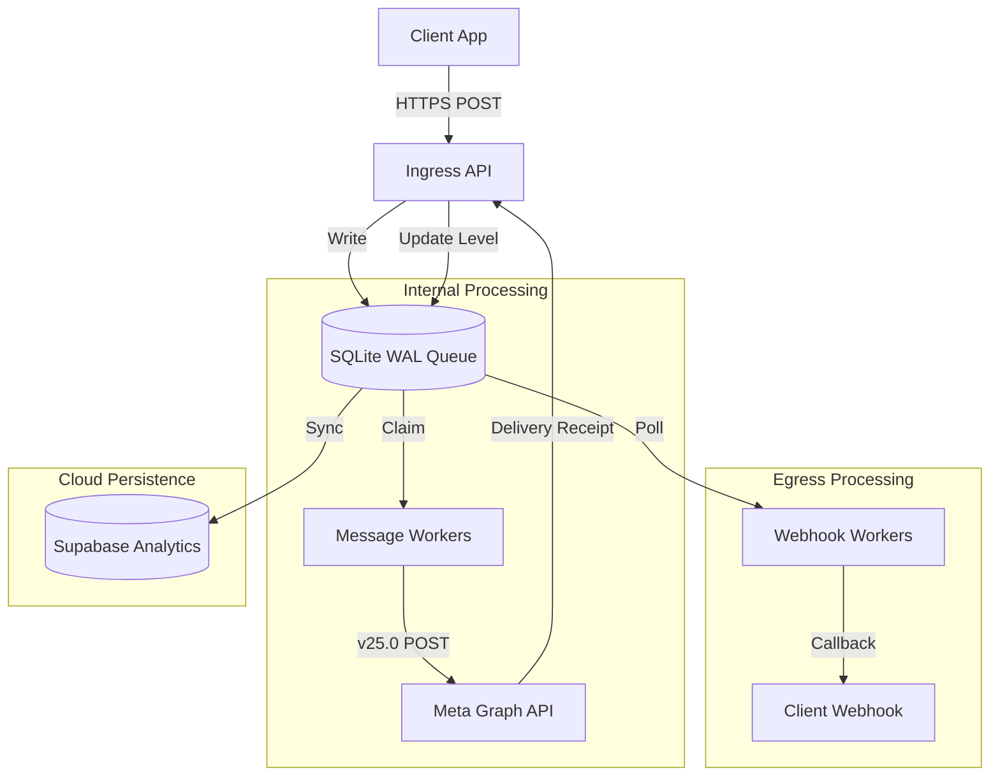

# System Architecture Overview

Bhejna is designed as a **Transactional Job Engine** that proxies communication between client applications and the Meta Graph API (WhatsApp Business API).

## High-Level Subsystems

### 1. Ingress API (The Receiver)
The Chi-based HTTP server that accepts message requests and Meta webhooks.
- **Client Endpoints**: Handles `/v1/messages`.
- **Webhook Endpoints**: Handles verification and event receipts from Meta.

### 2. Job Engine (The Core)
A persistent queue implemented on top of SQLite 3 in WAL mode.
- **Persistence**: Every message is stored before dispatch.
- **State Management**: Uses monotonic level-based updates to handle asynchronous events.

### 3. Worker Pools (The Executors)
- **Message Workers**: Claim jobs and interact with Meta Graph API.
- **Webhook Workers**: Forward events back to client-defined URLs.

### 4. Integration Layer (Supabase)
- **Sync Worker**: Periodically pushes terminal states to Supabase Analytics.
- **Hydration**: Pulls tenant data at boot-time to warm the local cache.

## Architecture Diagram

## Component Boundaries
- **Stateless**: The API layer and Workers carry no persistent state.
- **Stateful**: The SQLite database (`bhejna.db`) is the single source of truth for the local node.
- **Authoritative**: Supabase acts as the global registry for tenant metadata.
