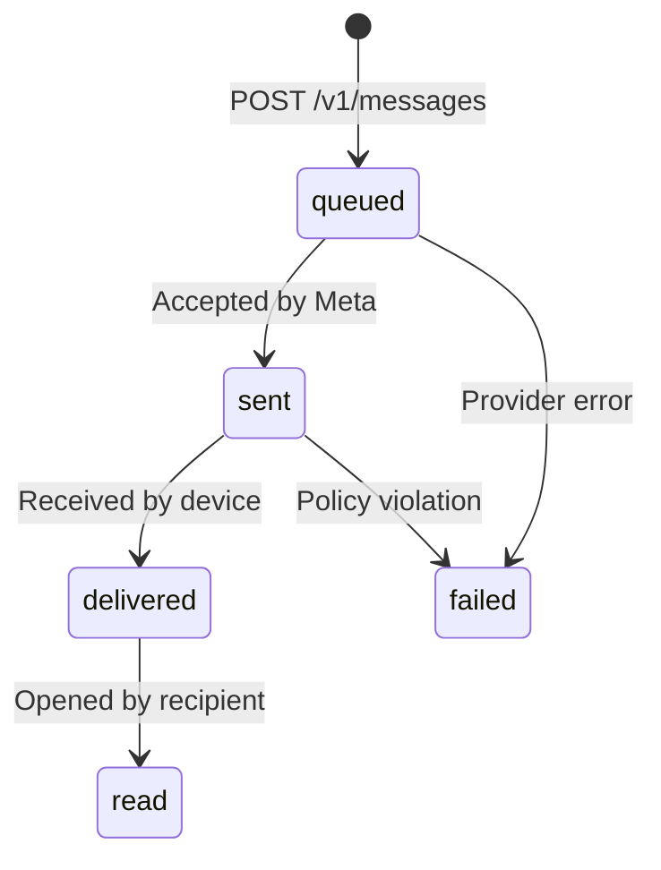

# Bhejna API Documentation

Bhejna is a developer-first WhatsApp messaging infrastructure platform. It provides a robust, idempotent API for sending messages and receiving real-time delivery events, abstracting away the complexities of Meta's Graph API.

Developers use Bhejna to:
- **Send notifications**: OTPs, transaction alerts, and marketing templates.
- **Manage Delivery**: Gain visibility into "sent", "delivered", and "read" states.
- **Scale Reliably**: Automatic retries, rate-limit management, and multi-tenant isolation.

---

# Quick Start

Get up and running with Bhejna in under 5 minutes.

### 1. Send your first message
Replace `<YOUR_API_KEY>` with your Bhejna token.

```bash
curl -X POST https://api.bhejna.com/v1/messages \
  -H "Authorization: Bearer <YOUR_API_KEY>" \
  -H "Content-Type: application/json" \
  -H "Idempotency-Key: message_12345" \
  -d '{
    "recipient": "+1234567890",
    "message_type": "text",
    "payload": {
      "body": "Hello from Bhejna!"
    }
  }'
```

### 2. Receive a delivery update
Bhejna will POST to your configured webhook URL when the status changes.

**Example Webhook Payload:**
```json
{
  "event": "message.delivered",
  "job_id": "01H2X3Y4Z5A6B7C8D9E0F1G2H3",
  "recipient": "+1234567890",
  "timestamp": "2026-05-09T12:00:00Z"
}
```

---

# Base URL

The Bhejna API is served over HTTPS. All requests must use the base URL:

| Environment | URL |
| :--- | :--- |
| **Production** | `https://api.bhejna.com` |
| **Local / Dev** | `http://localhost:8080` |

---

# Authentication

Bhejna uses Bearer tokens to authenticate requests. You can find your API key in the Bhejna Dashboard.

### Authorization Header
Include your API key in the `Authorization` header of every request.

```http
Authorization: Bearer bhejna_live_sk_...
```

> [!IMPORTANT]
> **Security Best Practice**: Never expose your API keys in client-side code (browsers, mobile apps). Always perform Bhejna API calls from your backend server.

---

# API Conventions

### JSON Structure
All request bodies and responses are JSON. Timestamps are returned in ISO 8601 (UTC) format.

### Idempotency
Bhejna supports idempotent requests to prevent duplicate messages during network retries. Pass a unique value in the `Idempotency-Key` header.
- If you retry a request with the same key, Bhejna will return the original `job_id` instead of creating a new one.

### Rate Limits
Limits are enforced per tenant based on your subscription plan.
- **Default Limit**: 250 messages per 24-hour rolling window.
- **Header**: Requests exceeding the limit will return `429 Too Many Requests`.

---

# Send Message API

## Endpoint
`POST /v1/messages`

## Purpose
Enqueues a message for delivery via WhatsApp.

## Headers
| Header | Required | Description |
| :--- | :--- | :--- |
| `Authorization` | Yes | `Bearer <your_token>` |
| `Content-Type` | Yes | `application/json` |
| `Idempotency-Key`| No | Unique string to prevent duplicate processing. |

## Request Body

| Field | Type | Required | Description |
| :--- | :--- | :--- | :--- |
| `recipient` | String | Yes | Recipient phone number in E.164 format (e.g., `+1234567890`). |
| `message_type` | String | Yes | One of: `text`, `template`, `image`, `document`, `audio`, `video`. |
| `payload` | Object | Yes | The message content (varies by type). |

### Validation Rules
- **Phone Number**: Must match `^\+?\d{7,15}$`.
- **Payload Size**: Maximum **64KB**.
- **Body Size**: Maximum **256KB** total request size.

## Example Requests

````carousel
```bash
# cURL
curl -X POST https://api.bhejna.com/v1/messages \
  -H "Authorization: Bearer <TOKEN>" \
  -d '{"recipient": "+1234567890", "message_type": "text", "payload": {"body": "Hi!"}}'
```
<!-- slide -->
```typescript
// TypeScript (Fetch)
const response = await fetch('https://api.bhejna.com/v1/messages', {
  method: 'POST',
  headers: {
    'Authorization': 'Bearer <TOKEN>',
    'Content-Type': 'application/json'
  },
  body: JSON.stringify({
    recipient: '+1234567890',
    message_type: 'text',
    payload: { body: 'Hi!' }
  })
});
const data = await response.json();
```
<!-- slide -->
```python
# Python (Requests)
import requests

resp = requests.post(
    "https://api.bhejna.com/v1/messages",
    headers={"Authorization": "Bearer <TOKEN>"},
    json={
        "recipient": "+1234567890",
        "message_type": "text",
        "payload": {"body": "Hi!"}
    }
)
print(resp.json())
```
````

## Success Response
`202 Accepted`
```json
{
  "job_id": "01H2X3Y4Z5A6B7C8D9E0F1G2H3",
  "status": "queued"
}
```

## Failure Responses

| Status | Error Code | Description |
| :--- | :--- | :--- |
| `400` | `INVALID_JSON` | Malformed request body. |
| `401` | `UNAUTHORIZED` | Missing or invalid API key. |
| `403` | `TENANT_PAUSED` | Your account is suspended due to policy violations. |
| `429` | `QUOTA_EXCEEDED`| You have reached your 24h messaging limit. |

---

# Delivery Lifecycle

Bhejna tracks every message through a state machine.



- **queued**: Message is in our persistent queue, waiting for dispatch.
- **sent**: Successfully handed off to Meta's infrastructure.
- **delivered**: Recipient's device confirmed receipt.
- **read**: Recipient opened the message (if read receipts are enabled).
- **failed**: A terminal failure occurred. Check `meta_error_message` in webhooks.

---

# Webhooks

Webhooks allow Bhejna to notify your server in real-time about message events.

## Configuration
Set your `webhook_url` and `webhook_secret` in the Bhejna Dashboard.

## Events
| Event | Description |
| :--- | :--- |
| `message.sent` | Handed off to Meta. |
| `message.delivered` | Recipient received message. |
| `message.read` | Recipient opened message. |
| `message.failed` | Delivery failed. |
| `message.received` | Inbound message from a user. |

## Signature Verification
Bhejna signs every webhook payload using your `webhook_secret`. We include a `X-Bhejna-Signature` header (HMAC-SHA256).

### Verification Example (Node.js)
```javascript
const crypto = require('crypto');

function verifySignature(payload, signature, secret) {
  const hmac = crypto.createHmac('sha256', secret);
  const digest = hmac.update(payload).digest('hex');
  return crypto.timingSafeEqual(Buffer.from(signature), Buffer.from(digest));
}
```

---

# Production Best Practices

1. **Implement Idempotency**: Always use the `Idempotency-Key` to handle network retries safely.
2. **Handle Webhooks Asynchronously**: Your webhook endpoint should return `200 OK` immediately and process the data in a background worker.
3. **Store Job IDs**: Keep the `job_id` returned by the API to correlate with future webhook events.
4. **Monitor Quotas**: Track your usage to avoid `429` errors during peak traffic.

---

# Troubleshooting

### Message stuck in `queued`
- Check if your tenant account is paused.
- Ensure your Meta access token is valid and hasn't expired.

### Webhook not received
- Verify your `webhook_url` is publicly accessible.
- Check Bhejna logs for "Webhook egress failed" errors.
- Bhejna retries webhook delivery 5 times with exponential backoff.

### Signature Mismatch
- Ensure you are using the raw request body for HMAC calculation.
- Verify that your `webhook_secret` matches the one in the Bhejna Dashboard.

---

# FAQ

**Q: Can I send template messages?**
A: Yes. Set `message_type` to `template` and provide the template name and parameters in the `payload`.

**Q: What is the maximum message length?**
A: Bhejna follows Meta's limits (typically 4096 characters for text messages).

**Q: Do you support multi-media?**
A: Yes. We support `image`, `video`, `document`, and `audio` types. Pass the media URL in the payload.

---
*© 2026 Bhejna Messaging Platform. All rights reserved.*
